# Case Study II
Trace Smith & Damon Resnick  
December 1, 2016  


<br>

### Question 1

**Create the following X matrix and print it from SAS, R, and Python.**


- **SAS Code**

```{}
proc iml;
/*create 3x4 matrix*/
reset print;
x={4 5 1 2,
   1 0 3 5,
   2 1 8 2};
quit;
```

- SAS output for X matrix shown below:


- **R Code**


```r
mymatrix <- matrix(c(4, 1, 2, 5, 0, 1, 1, 3, 8, 2, 5, 2), nrow = 3, ncol = 4)
print(mymatrix)
```

```
##      [,1] [,2] [,3] [,4]
## [1,]    4    5    1    2
## [2,]    1    0    3    5
## [3,]    2    1    8    2
```

- **Python Code**

```{}
import numpy as np
x = np.matrix([[4,5,1,2],[1,0,3,5],[2,1,8,2]])
print x
```

 - Python output (Ipython Notebook):
 
 

<br>

### Question 2

- **Answer the following questions for Air Products & Chemicals, Inc. stock (symbol = `ADP`):**


- **1.) Download the data.**

```r
library(tseries)
# SNPdatahist <- get.hist.quote('^gspc',quote='Close')
SNPdata <- get.hist.quote("adp", quote = "Close")
```

```
## time series ends   2016-11-23
```

```r
plot(SNPdata)
```

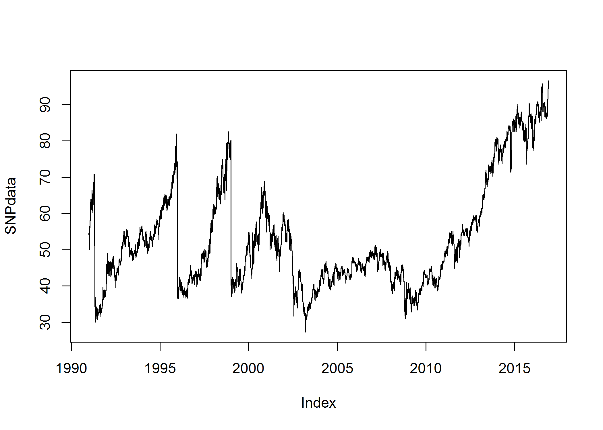

<br>  

- **2.) Calculate log returns.**

```r
SNPret <- log(lag(SNPdata)) - log(SNPdata)
SNPret <- SNPret[!(is.na(SNPret)), ]
```

<br>  

- **3.) Calculate volatility measure.**

```r
SNPvol <- sd(SNPret) * sqrt(250) * 100
SNPvol
```

```
## [1] 34.29964
```

<br>  

- **4.) Calculate volatility over entire length of series for various three different decay factors.**

```r
## volatility
get
```

```
## function (x, pos = -1L, envir = as.environment(pos), mode = "any", 
##     inherits = TRUE) 
## .Internal(get(x, envir, mode, inherits))
## <bytecode: 0x00000000135e7120>
## <environment: namespace:base>
```

```r
Vol <- function(d, logrets) {
    var = 0
    lam = 0
    varlist <- c()
    for (r in logrets) {
        lam = lam * (1 - 1/d) + 1
        var = (1 - 1/lam) * var + (1/lam) * r^2
        varlist <- c(varlist, var)
    }
    sqrt(varlist)
}

volest <- Vol(10, SNPret)
volest2 <- Vol(30, SNPret)
volest3 <- Vol(100, SNPret)
```

<br>  

- **5.) Plot the results, overlaying the volatility curves on the data, just as was done in the S&P example.**

```r
plot(volest, type = "l")
lines(volest2, type = "l", col = "red")
lines(volest3, type = "l", col = "blue")
```

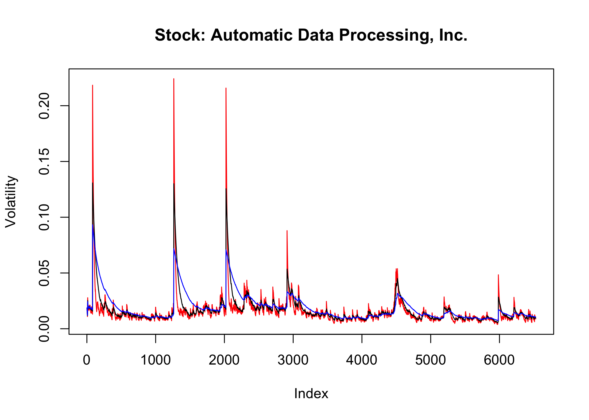

<br>

### Question 3

- The built-in data set called `Orange` in R is about the growth of orange trees. The `Orange` data frame has 3 columns of records of the growth of orange trees.

**Variable description**

- *Tree*: an ordered factor indicating the tree on which the measurement is made. The ordering  is according to increasing maximum diameter.

- *age*: a numeric vector giving the age of the tree (days since 1968/12/31) circumference: a numeric vector of trunk circumferences (mm). This is probably 'circumference at breast height', a standard measurement in forestry.

- First, let's load the `Orange` data set into a data frame and examine the structure of the data:

```r
# Read in Orange dataset from R into data.frame
df <- data.frame(Orange)
```


```r
# Return first 6 rows of Orange df
pander(head(df))
```


----------------------------
 Tree   age   circumference 
------ ----- ---------------
  1     118        30       

  1     484        58       

  1     664        87       

  1    1004        115      

  1    1231        120      

  1    1372        142      
----------------------------


```r
# get summary of Orange dataset
summary(df)
```

```
##  Tree       age         circumference  
##  3:7   Min.   : 118.0   Min.   : 30.0  
##  1:7   1st Qu.: 484.0   1st Qu.: 65.5  
##  5:7   Median :1004.0   Median :115.0  
##  2:7   Mean   : 922.1   Mean   :115.9  
##  4:7   3rd Qu.:1372.0   3rd Qu.:161.5  
##        Max.   :1582.0   Max.   :214.0
```


```r
# get structure of each columns
str(df)
```

```
## 'data.frame':	35 obs. of  3 variables:
##  $ Tree         : Ord.factor w/ 5 levels "3"<"1"<"5"<"2"<..: 2 2 2 2 2 2 2 4 4 4 ...
##  $ age          : num  118 484 664 1004 1231 ...
##  $ circumference: num  30 58 87 115 120 142 145 33 69 111 ...
```

```r
df$Tree <- as.character(df$Tree)
```


```r
# Take a look at the data
p <- ggplot(df) + geom_point(aes(y = age, x = Tree, colour = Tree, shape = Tree), 
    size = 3) + scale_colour_hue(l = 80, c = 150)
p + labs(title = "Age vs Tree Type", x = "Tree type", y = "Age", colour = "Tree")
```

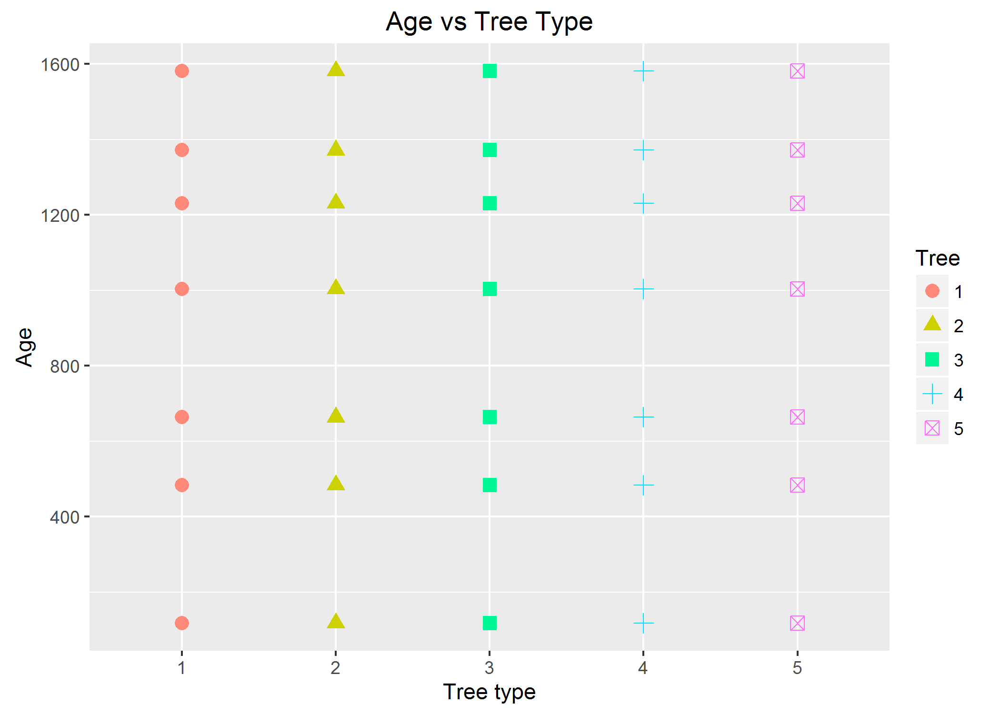

#### There are seven different ages in years:(118, 484, 664, 1004, 1231, 1372, 1582) and five tree types (1-5).  

<br>  


```r
p2 <- ggplot(df) + geom_point(aes(y = circumference, x = Tree, colour = Tree, shape = Tree), 
    size = 3) + scale_colour_hue(l = 80, c = 150)
p2 + labs(title = "Circumference vs. Tree Type", x = "Tree type", y = "Circumference", 
    colour = "Tree")
```

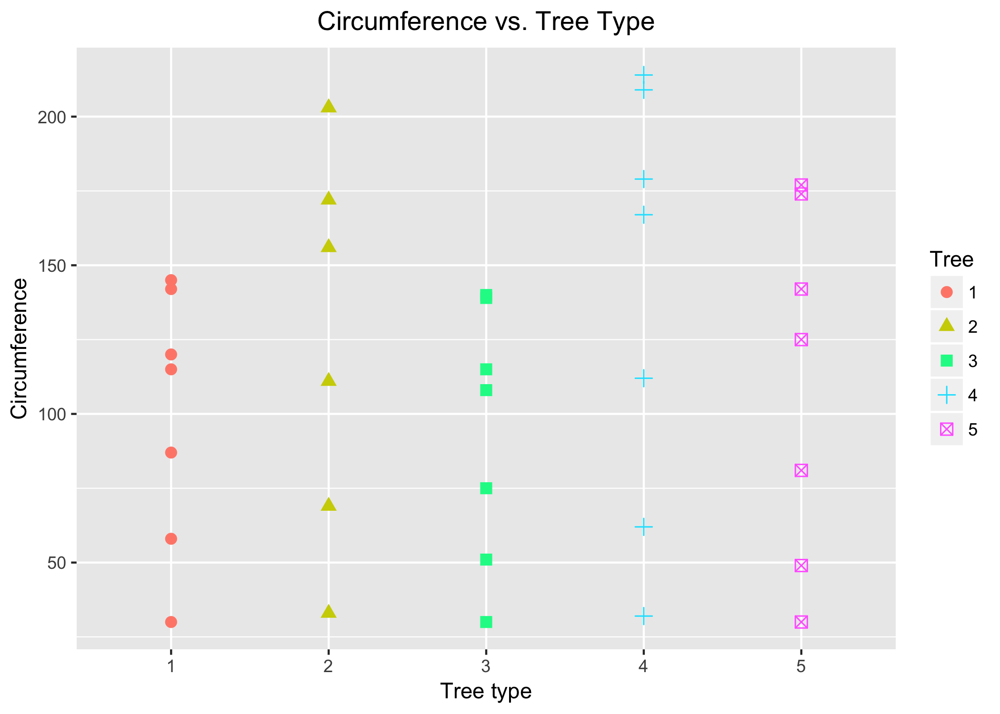

<br>  


- **a) Calculate the mean and the median of the trunk circumferences for different size of the trees. (Tree)**


```r
# aggregate data.frame by Tree and compute mean circumference
circum.mean <- aggregate(df$circumference, by = list(df$Tree), FUN = mean)
colnames(circum.mean) <- c("Tree", "Mean Circ.")
circum.mean
```

```
##   Tree Mean Circ.
## 1    1   99.57143
## 2    2  135.28571
## 3    3   94.00000
## 4    4  139.28571
## 5    5  111.14286
```


```r
# aggregate data.frame by Tree and compute median circumference
circum.median <- aggregate(df$circumference, by = list(df$Tree), FUN = median)
colnames(circum.median) <- c("Tree", "Median Circ.")
circum.median
```

```
##   Tree Median Circ.
## 1    1          115
## 2    2          156
## 3    3          108
## 4    4          167
## 5    5          125
```

- **b) Make a scatter plot of the trunk circumferences against the age of the tree. Use different plotting symbols for different size of trees.**labs(title="Scatter Plot \n Age vs Circumference by Tree",x="Age",y="Circumference",
         colour="Tree")


```r
# Scatter plot
p <- ggplot(df) + geom_point(aes(y = circumference, x = age, colour = Tree, shape = Tree), 
    size = 3) + scale_colour_hue(l = 80, c = 150)
p + labs(title = "Age vs Circumference by Tree", x = "Age", y = "Circumference", 
    colour = "Tree")
```

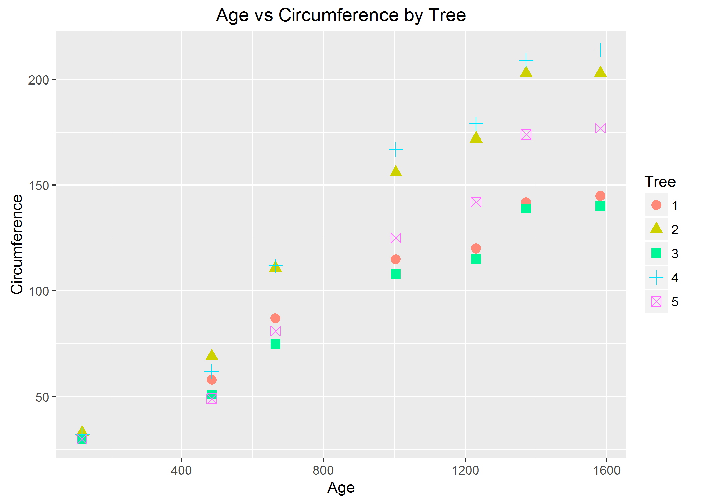


```r
# Line plot
p <- ggplot(df, aes(y = circumference, x = age, colour = Tree)) + geom_point(aes(shape = Tree), 
    size = 3) + geom_line(size = 1, alpha = 0.8) + scale_colour_hue(l = 80, c = 150)
p + labs(title = "Age vs Circumference by Tree", x = "Age", y = "Circumference", 
    colour = "Tree")
```

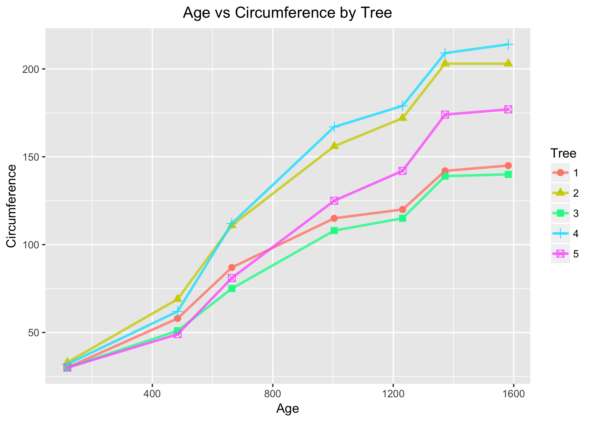


- **c) Display the trunk circumferences on a comparative boxplot against tree. Be sure you order the boxplots in the increasing order of maximum diameter.**


```r
# Determine the max circum by each group and reorder the levels accordingly
circum.max <- aggregate(df$circumference, by = list(df$Tree), FUN = max)  #aggregate for max circum
colnames(circum.max) <- c("Tree", "Max Circum.")  #rename columns
circum.max
```

```
##   Tree Max Circum.
## 1    1         145
## 2    2         203
## 3    3         140
## 4    4         214
## 5    5         177
```


```r
df$Tree <- factor(df$Tree, c("3", "1", "5", "2", "4"))  #reorder the boxplot for max circum. by tree
```


```r
p <- ggplot(df, aes(x = Tree, y = circumference)) + geom_boxplot(aes(fill = Tree))  # ggplot: boxplot 
p + labs(title = "Box Plot: Trunk Circumference", y = "Circumference", x = "Tree")
```

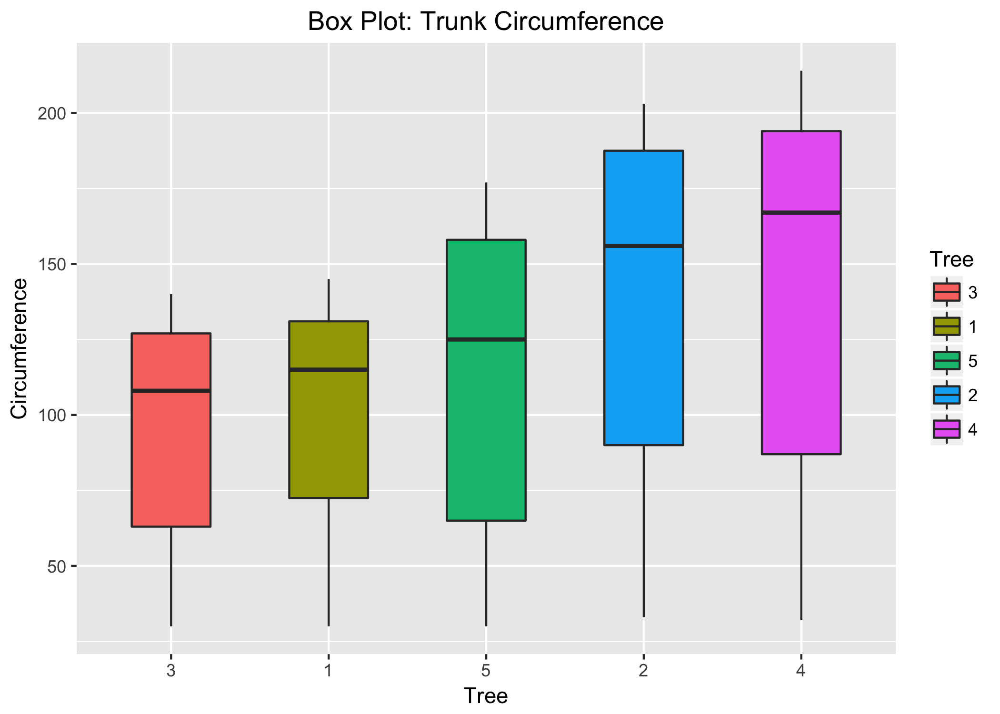

<br>

### Question 4

###(i) First, download a 'Temp' data set. Find the difference between the maximum and the minimum monthly average temperatures for each country and report/visualize top 20 countries with the maximum differences for the period since 1900.**

<br>

#### Load data

```r
tempraw <- read.csv("./Data/Temp.csv", header = TRUE)
```


```r
temp <- tempraw
# Need to make Date column into a character in order to use grepl to extract out
# other date format
temp$Date <- as.character(temp$Date)
# This deletes all the dates below 1900 because all of those dates are in a
# different format with '-' and not '/'
temp <- temp[!grepl("-", temp$Date), ]
# Remove any columns with 'NA' just to be careful
temp1 <- temp[!(is.na(temp$Date)), ]
temp1 <- temp1[!(is.na(temp1$Monthly.AverageTemp)), ]
temp1 <- temp1[!(is.na(temp1$Monthly.AverageTemp.Uncertainty)), ]
temp1 <- temp1[!(is.na(temp1$Country)), ]
# Make Country column a character to make it easier later
temp1$Country <- as.character(temp1$Country)
```


```r
# Aggregate for max and min average temps
temp.max <- aggregate(temp1["Monthly.AverageTemp"], by = temp1["Country"], FUN = max)
temp.min <- aggregate(temp1["Monthly.AverageTemp"], by = temp1["Country"], FUN = min, 
    na.rm = TRUE)
```


```r
# Create new data.frame to join the two aggregated list
data <- data.frame(temp.max, temp.min)
# Drop extra Country column
data$Country.1 <- NULL
# pander(head(data)) Rename column
colnames(data) <- c("Country", "Max Avg. Temp", "Min Avg. Temp")
pander(head(data))
```


----------------------------------------------
   Country      Max Avg. Temp   Min Avg. Temp 
-------------- --------------- ---------------
 Afghanistan        28.53          -4.553     

    Africa          27.13           19.79     

   Albania          25.47          -2.049     

   Algeria          35.83           9.591     

American Samoa      28.54           24.71     

   Andorra          24.31          -0.361     
----------------------------------------------

```r
# Take difference between max and min avg. temp columns
data$Diff <- data$"Max Avg. Temp" - data$"Min Avg. Temp"

# Sort the dataframe by decreasing Diff
data <- data[order(data$Diff, data$Country, decreasing = TRUE), ]
pander(head(data, 20))
```


-------------------------------------------------------------
 &nbsp;     Country     Max Avg. Temp   Min Avg. Temp   Diff 
--------- ------------ --------------- --------------- ------
 **115**   Kazakhstan       25.56           -23.6      49.16 

 **144**    Mongolia        20.72          -27.29      48.01 

 **180**     Russia         16.89          -29.79      46.68 

 **39**      Canada         14.8           -28.74      43.53 

 **234**   Uzbekistan       30.38          -12.32       42.7 

 **225**  Turkmenistan      32.14          -8.443      40.58 

 **22**     Belarus         22.81          -16.53      39.34 

 **75**     Finland         18.97           -20.1      39.07 

 **68**     Estonia         22.33          -16.48      38.81 

 **228**    Ukraine         23.94          -14.72      38.66 

 **120**   Kyrgyzstan       19.27          -19.16      38.44 

 **160**  North Korea       23.95          -14.39      38.34 

 **122**     Latvia         22.28          -15.78      38.06 

 **142**    Moldova         25.23          -12.78      38.01 

 **88**    Greenland        0.339          -37.18      37.52 

 **58**     Denmark         0.699          -36.44      37.14 

 **128**   Lithuania        21.79          -15.18      36.97 

 **216**   Tajikistan       19.36          -16.47      35.83 

 **174**     Poland         22.51          -13.11      35.62 

 **11**     Armenia         25.29          -9.982      35.27 
-------------------------------------------------------------

```r
# Subset the data to only take the first 20 columns with highest temp diff.
data.sub <- data[1:20, ]
```


```r
##### Needs Changing..... plot Country vs Temp Diff

# p <- ggplot(data.sub,aes(Country,fill=Diff))+geom_bar() + coord_flip() p +
# labs(title='Country vs Change in Temperature', x='Maximum - Minimum Avg.
# Monthly Temp', y = 'Country')

p <- ggplot(data.sub) + geom_point(aes(x = Country, y = Diff), size = 3, colour = "Red")
p + labs(title = "Difference per Country") + theme(axis.text.x = element_text(angle = 60, 
    hjust = 1), legend.position = "none")
```

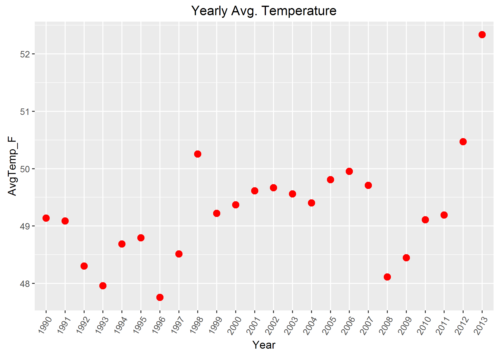


###(ii) Select a subset of data called 'UStemp' where US land temperatures from 01/01/1990 in Temp data. Use UStemp dataset to answer the followings.**


```r
temp.usa <- subset(temp1, temp1$Country == "United States")
# pander(head(temp.usa))
which(temp.usa$Date == "1/1/90")
```

```
## [1] 1081
```

```r
temp.usa <- temp.usa[-c(1:1080), ]
temp.usa$Date <- as.Date(temp.usa$Date, format = "%m/%d/%y")
```

<br>

  - **a) Create a new column to display the monthly average land temperatures in Fahrenheit (°F).**
  

```r
temp.usa$Temp_F <- ((temp.usa$Monthly.AverageTemp * (9/5)) + 32)
```
  
<br>

  - **b) Calculate average land temperature by year and plot it. The original file has the average land temperature by month.** 


```r
temp.usa$year <- substr(temp.usa$Date, 1, 4)
temp.usa.year <- aggregate(temp.usa$Temp_F, by = list(temp.usa$year), FUN = mean)
colnames(temp.usa.year) <- c("Year", "AvgTemp_F")
# plot(temp.usa.year) temp.usa.year$year <- as.integer(temp.usa.year$Year)
p <- ggplot(temp.usa.year) + geom_point(aes(x = Year, y = AvgTemp_F), size = 3, colour = "Red")
p + labs(title = "Yearly Avg. Temperature") + theme(axis.text.x = element_text(angle = 60, 
    hjust = 1), legend.position = "none")
```

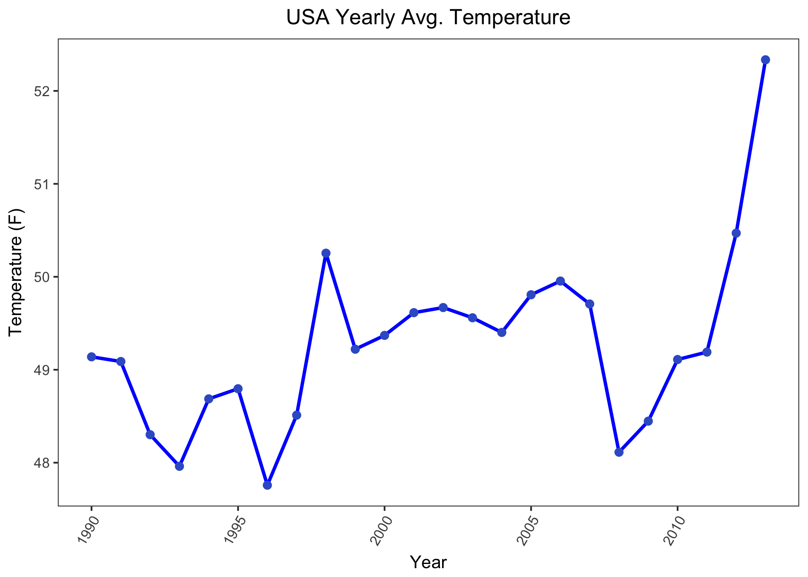

<br>

  - **c) Calculate the one year difference of average land temperature by year and provide the maximum difference (value) with corresponding two years.**

```r
temp.usa.year.diff <- temp.usa.year$AvgTemp_F[1:23] - temp.usa.year$AvgTemp_F[2:24]
temp.usa.year.diff.year <- c("1990-1991", "1991-1992", "1992-1993", "1993-1994", 
    "1994-1995", "1995-1996", "1996-1997", "1997-1998", "1998-1999", "1999-2000", 
    "2000-2001", "2001-2002", "2002-2003", "2003-2004", "2004-2005", "2005-2006", 
    "2006-2007", "2007-2008", "2008-2009", "2009-2010", "2010-2011", "2011-2012", 
    "2012-2013")
temp.usa.ydiff <- data.frame(temp.usa.year.diff.year, temp.usa.year.diff)
colnames(temp.usa.ydiff) <- c("Years", "AvgTempDiff")
# plot(temp.usa.ydiff)
p <- ggplot(temp.usa.ydiff) + geom_point(aes(x = Years, y = AvgTempDiff), size = 3, 
    colour = "Red")
p + labs(title = "Yearly Average Difference") + theme(axis.text.x = element_text(angle = 60, 
    hjust = 1), legend.position = "none")
```

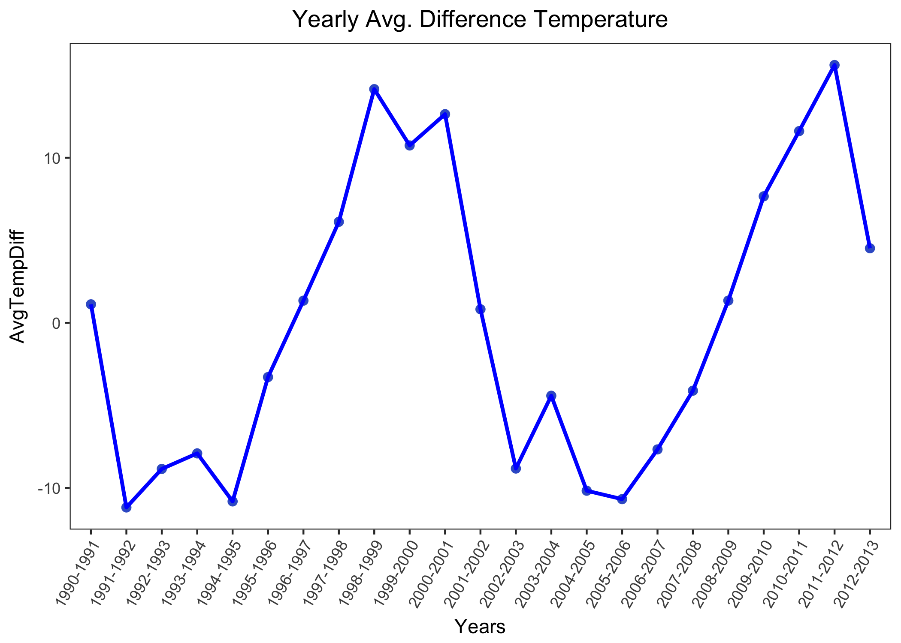

<br>

###(iii) Download 'CityTemp' data set. Find the difference between the maximum and the minimum temperatures for each major city and report/visualize top 20 cities with maximum differences for the period since 1900.**  

#### Load data

```r
citytempraw <- read.csv("./Data/CityTemp.csv", header = TRUE)
citytemp <- citytempraw
# Need to make Date column into a character in order to use grepl to extract out
# other date format
citytemp$Date <- as.character(citytemp$Date)
# This deletes all the dates below 1900 because all of those dates are in a
# different format with '-' and not '/'
citytemp <- citytemp[!grepl("-", citytemp$Date), ]
# Remove any columns with 'NA' just to be careful
citytemp1 <- citytemp[!(is.na(citytemp$Date)), ]
citytemp1 <- citytemp1[!(is.na(citytemp1$Monthly.AverageTemp)), ]
citytemp1 <- citytemp1[!(is.na(citytemp1$Monthly.AverageTemp.Uncertainty)), ]
citytemp1 <- citytemp1[!(is.na(citytemp1$City)), ]
citytemp1 <- citytemp1[!(is.na(citytemp1$Country)), ]
citytemp1 <- citytemp1[!(is.na(citytemp1$Latitude)), ]
citytemp1 <- citytemp1[!(is.na(citytemp1$Longitude)), ]
# Make other columns a character to make it easier later
citytemp1$City <- as.character(citytemp1$City)
citytemp1$Country <- as.character(citytemp1$Country)
citytemp1$Latitude <- as.character(citytemp1$Latitude)
citytemp1$Longitude <- as.character(citytemp1$Longitude)
```


```r
# Aggregate for max and min average temps
citytemp.max <- aggregate(citytemp1["Monthly.AverageTemp"], by = citytemp1["City"], 
    FUN = max)
citytemp.min <- aggregate(citytemp1["Monthly.AverageTemp"], by = citytemp1["City"], 
    FUN = min, na.rm = TRUE)
```


```r
# Create new data.frame to join the two aggregated list
citydata <- data.frame(citytemp.max, citytemp.min)
# Drop extra Country column
citydata$City.1 <- NULL
# head(citydata) Rename column
colnames(citydata) <- c("City", "Max Avg. Temp", "Min Avg. Temp")
# head(citydata) Take difference between max and min avg. temp columns
citydata$Diff <- citydata$"Max Avg. Temp" - citydata$"Min Avg. Temp"

# Sort the dataframe by decreasing Diff
citydata <- citydata[order(citydata$Diff, citydata$City, decreasing = TRUE), ]
pander(head(citydata, 20))
```


----------------------------------------------------------------
 &nbsp;        City        Max Avg. Temp   Min Avg. Temp   Diff 
-------- ---------------- --------------- --------------- ------
 **34**       Harbin           26.51          -26.77      53.28 

 **19**     Changchun          26.57          -23.27      49.84 

 **65**       Moscow           24.58          -19.38      43.96 

 **85**      Shenyang          26.01          -17.04      43.05 

 **64**      Montreal          23.06          -18.36      41.42 

 **48**        Kiev            24.59          -16.19      40.78 

 **79**  Saint Petersburg      21.92          -18.59      40.51 

 **96**      Toronto           23.18           -15.5      38.68 

 **92**      Taiyuan           24.72          -13.12      37.83 

 **94**      Tianjin           28.94          -8.017      36.95 

 **73**       Peking           28.94          -8.017      36.95 

 **83**       Seoul            26.79          -8.992      35.78 

 **60**      Mashhad           27.23          -8.384      35.61 

 **24**       Dalian           25.88          -9.348      35.22 

 **21**      Chicago           26.37           -8.59      34.96 

 **93**      Tangshan          27.35          -7.487      34.83 

 **71**      New York          25.31          -9.147      34.46 

 **6**       Baghdad           38.28           4.236      34.05 

 **10**       Berlin           23.8           -10.12      33.92 

 **43**       Jinan            28.39          -5.389      33.78 
----------------------------------------------------------------

```r
# Subset the data to only take the first 20 columns with highest temp diff.
citydata.sub <- citydata[1:20, ]

p <- ggplot(citydata.sub) + geom_point(aes(x = City, y = Diff), size = 3, colour = "Red")
p + labs(title = "Difference per City") + theme(axis.text.x = element_text(angle = 60, 
    hjust = 1), legend.position = "none")
```


<br>

###(iv) Compare the two graphs in (i) and (iii)  and comment it.**


```r
p4 <- ggplot() + geom_point(data = data.sub, aes(x = data.sub$Country, y = data.sub$Diff), 
    color = "Blue3", size = 3) + geom_point(data = citydata.sub, aes(x = citydata.sub$City, 
    y = citydata.sub$Diff), color = "Red2", size = 3)
p4 + labs(title = "Max Difference for Top 20 Countries/Cities", x = "Countries (Blue) and Cities (Red)", 
    y = "Max Difference") + theme(title = element_text(size = 14), axis.title = element_text(size = 14), 
    axis.text.x = element_text(angle = 60, hjust = 1), legend.position = "none")
```

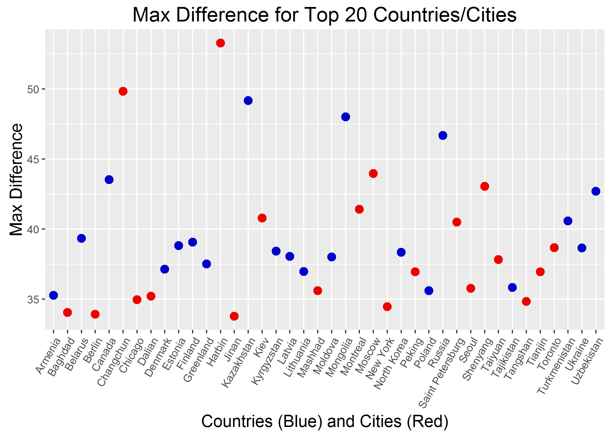
<br>  

#### Looking at the top 20 countries and cities in the world for the temperature swing during a year we see that the City of Harbin has the largest temperature swing, but by and large the countries have a wider temperature swing than the major cities. It is intersting to note that Russia has the 3rd largest temperature swing for a country and has two major cities in the top 20. Canada ranked 4th, also has two top 20 cities while the US is not ranked in the top 20 but has two cities in the top 20.


<br>  


### Question 05  (10 points)   


####Christmas Bonus


