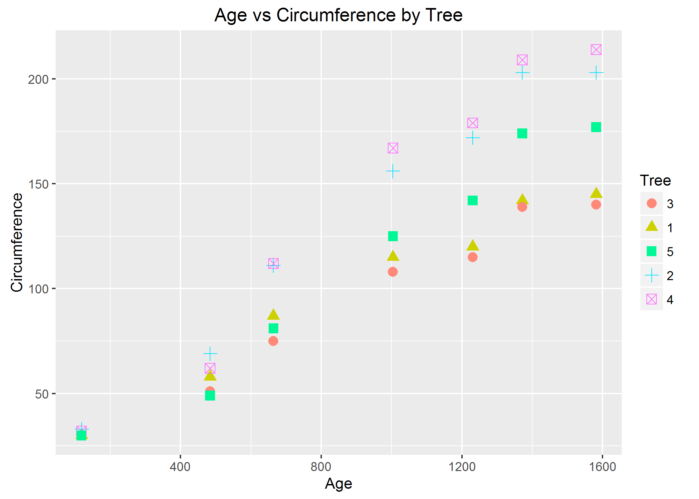
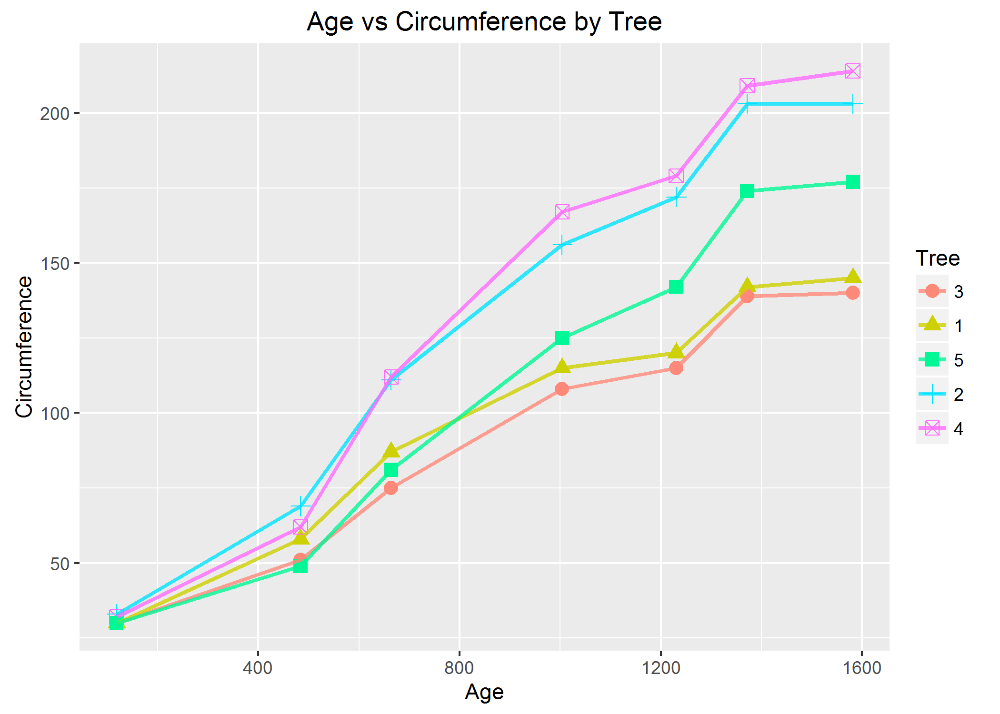
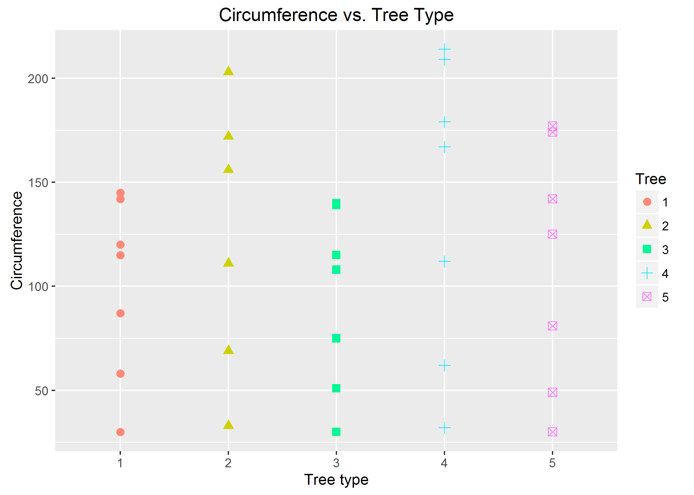
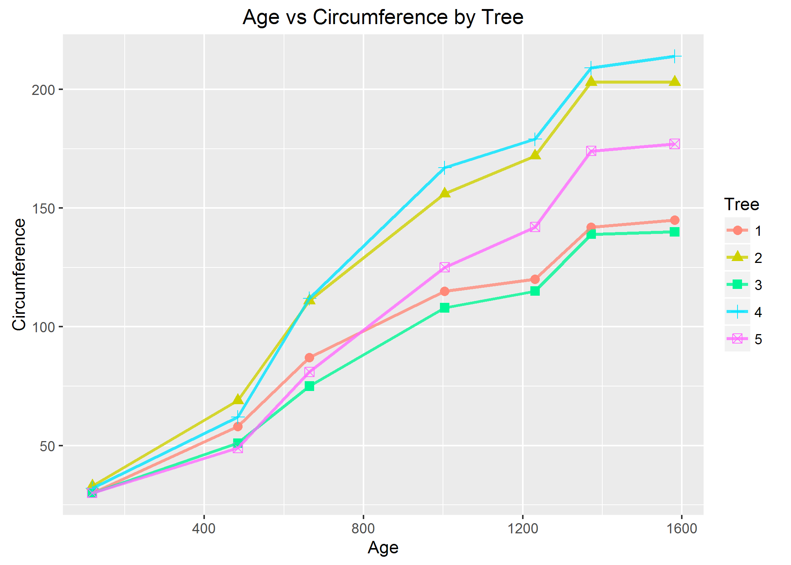

# Case Study II
Trace Smith & Damon Resnick  
November 21, 2016  


<br>

### Question 1

**Create the following X matrix and print it from SAS, R, and Python.**


- **SAS Code**

```{}
proc iml;
/*create 3x4 matrix*/
reset print;
x={4 5 1 2,
   1 0 3 5,
   2 1 8 2};
quit;
```

- SAS output for X matrix shown below:


- **R Code**


```r
mymatrix <- matrix(c(4, 1, 2, 5, 0, 1, 1, 3, 8, 2, 5, 2), nrow = 3, ncol = 4)
print(mymatrix)
```

```
##      [,1] [,2] [,3] [,4]
## [1,]    4    5    1    2
## [2,]    1    0    3    5
## [3,]    2    1    8    2
```

- **Python Code**

```{}
import numpy as np
x = np.matrix([[4,5,1,2],[1,0,3,5],[2,1,8,2]])
print x
```

 - Python output (Ipython Notebook):
 
 

<br>

### Question 2

- **Answer the following questions for Air Products & Chemicals, Inc. stock (symbol = `ADP`):**


- **1.) Download the data.**


- **2.) Calculate log returns.**


- **3.) Calculate volatility measure.**


- **4.) Calculate volatility over entire length of series for various three different decay factors.**


- **5.) Plot the results, overlaying the volatility curves on the data, just as was done in the S&P example.**

<br>

### Question 3

- The built-in data set called `Orange` in R is about the growth of orange trees. The `Orange` data frame has 3 columns of records of the growth of orange trees.

**Variable description**

- *Tree*: an ordered factor indicating the tree on which the measurement is made. The ordering  is according to increasing maximum diameter.

- *age*: a numeric vector giving the age of the tree (days since 1968/12/31) circumference: a numeric vector of trunk circumferences (mm). This is probably 'circumference at breast height', a standard measurement in forestry.

- First, let's load the `Orange` data set into a data frame and examine the structure of the data:

```r
# Read in Orange dataset from R into data.frame
df <- data.frame(Orange)
```


```r
# Return first 5 rows of Orange df
head(df)
```

```
##   Tree  age circumference
## 1    1  118            30
## 2    1  484            58
## 3    1  664            87
## 4    1 1004           115
## 5    1 1231           120
## 6    1 1372           142
```


```r
# get summary of Orange dataset
summary(df)
```

```
##  Tree       age         circumference  
##  3:7   Min.   : 118.0   Min.   : 30.0  
##  1:7   1st Qu.: 484.0   1st Qu.: 65.5  
##  5:7   Median :1004.0   Median :115.0  
##  2:7   Mean   : 922.1   Mean   :115.9  
##  4:7   3rd Qu.:1372.0   3rd Qu.:161.5  
##        Max.   :1582.0   Max.   :214.0
```


```r
# get structure of each columns
str(df$Tree)
```

```
##  Ord.factor w/ 5 levels "3"<"1"<"5"<"2"<..: 2 2 2 2 2 2 2 4 4 4 ...
```

```r
str(df$age)
```

```
##  num [1:35] 118 484 664 1004 1231 ...
```

```r
str(df$circumference)
```

```
##  num [1:35] 30 58 87 115 120 142 145 33 69 111 ...
```

- **a) Calculate the mean and the median of the trunk circumferences for different size of the trees. (Tree)**


```r
# aggregate data.frame by Tree and compute mean circumference
circum.mean <- aggregate(df$circumference, by = list(df$Tree), FUN = mean)
colnames(circum.mean) <- c("Tree", "Mean Circ.")
circum.mean
```

```
##   Tree Mean Circ.
## 1    3   94.00000
## 2    1   99.57143
## 3    5  111.14286
## 4    2  135.28571
## 5    4  139.28571
```


```r
# aggregate data.frame by Tree and compute median circumference
circum.median <- aggregate(df$circumference, by = list(df$Tree), FUN = median)
colnames(circum.median) <- c("Tree", "Median Circ.")
circum.median
```

```
##   Tree Median Circ.
## 1    3          108
## 2    1          115
## 3    5          125
## 4    2          156
## 5    4          167
```

- **b) Make a scatter plot of the trunk circumferences against the age of the tree. Use different plotting symbols for different size of trees.**labs(title="Scatter Plot \n Age vs Circumference by Tree",x="Age",y="Circumference",
         colour="Tree")


```r
# Load ggplot2
library(ggplot2)

# Scatter plot
p <- ggplot(df) + geom_point(aes(y = circumference, x = age, colour = Tree, shape = Tree), 
    size = 3) + scale_colour_hue(l = 80, c = 150)
p + labs(title = "Age vs Circumference by Tree", x = "Age", y = "Circumference", 
    colour = "Tree")
```




```r
# Line plot
p <- ggplot(df, aes(y = circumference, x = age, colour = Tree)) + geom_point(aes(shape = Tree), 
    size = 3) + geom_line(size = 1, alpha = 0.8) + scale_colour_hue(l = 80, c = 150)
p + labs(title = "Age vs Circumference by Tree", x = "Age", y = "Circumference", 
    colour = "Tree")
```




- **c) Display the trunk circumferences on a comparative boxplot against tree. Be sure you order the boxplots in the increasing order of maximum diameter.**


```r
# Determine the max circum by each group and reorder the levels accordingly
circum.max <- aggregate(df$circumference, by = list(df$Tree), FUN = max)  #aggregate for max circum
colnames(circum.max) <- c("Tree", "Max Circum.")  #rename columns
circum.max
```

```
##   Tree Max Circum.
## 1    3         140
## 2    1         145
## 3    5         177
## 4    2         203
## 5    4         214
```


```r
factor(df$Tree, c("3", "1", "5", "2", "4"))  #reorder the boxplot for max circum. by tree
```

```
##  [1] 1 1 1 1 1 1 1 2 2 2 2 2 2 2 3 3 3 3 3 3 3 4 4 4 4 4 4 4 5 5 5 5 5 5 5
## Levels: 3 < 1 < 5 < 2 < 4
```


```r
p <- ggplot(df, aes(x = Tree, y = circumference)) + geom_boxplot(aes(fill = Tree))  # ggplot: boxplot 
p + labs(title = "Box Plot: Trunk Circumference", y = "Circumference", x = "Tree")
```



<br>

### Question 4

- **1.)	First, download a 'Temp' data set. Find the difference between the maximum and the minimum monthly average temperatures for each country and report/visualize top 20 countries with the maximum differences for the period since 1900.**

<br>

#Load csv

```r
tempraw <- read.csv("./Data/Temp.csv", header = TRUE)
temp <- tempraw
# Need to make Date column into a character in order to use grepl to extract out
# other date format
temp$Date <- as.character(temp$Date)
# This deletes all the dates below 1900 because all of those dates are in a
# different format with '-' and not '/'
temp <- temp[!grepl("-", temp$Date), ]
# Remove any columns with 'NA' just to be careful
temp1 <- temp[!(is.na(temp$Date)), ]
temp1 <- temp1[!(is.na(temp1$Monthly.AverageTemp)), ]
temp1 <- temp1[!(is.na(temp1$Monthly.AverageTemp.Uncertainty)), ]
temp1 <- temp1[!(is.na(temp1$Country)), ]
# Make Country column a character to make it easier later
temp1$Country <- as.character(temp1$Country)
```


```r
# Aggregate for max and min average temps
temp.max <- aggregate(temp1["Monthly.AverageTemp"], by = temp1["Country"], FUN = max)
temp.min <- aggregate(temp1["Monthly.AverageTemp"], by = temp1["Country"], FUN = min, 
    na.rm = TRUE)
```


```r
# Create new data.frame to join the two aggregated list
data <- data.frame(temp.max, temp.min)
# Drop extra Country column
data$Country.1 <- NULL
head(data)
```

```
##          Country Monthly.AverageTemp Monthly.AverageTemp.1
## 1    Afghanistan              28.533                -4.553
## 2         Africa              27.126                19.794
## 3        Albania              25.474                -2.049
## 4        Algeria              35.829                 9.591
## 5 American Samoa              28.543                24.712
## 6        Andorra              24.313                -0.361
```

```r
# Rename column
colnames(data) <- c("Country", "Max Avg. Temp", "Min Avg. Temp")
head(data)
```

```
##          Country Max Avg. Temp Min Avg. Temp
## 1    Afghanistan        28.533        -4.553
## 2         Africa        27.126        19.794
## 3        Albania        25.474        -2.049
## 4        Algeria        35.829         9.591
## 5 American Samoa        28.543        24.712
## 6        Andorra        24.313        -0.361
```

```r
# Take difference between max and min avg. temp columns
data$Diff <- data$"Max Avg. Temp" - data$"Min Avg. Temp"

# Sort the dataframe by decreasing Diff
data <- data[order(data$Diff, data$Country, decreasing = TRUE), ]
head(data, 20)
```

```
##          Country Max Avg. Temp Min Avg. Temp   Diff
## 115   Kazakhstan        25.562       -23.601 49.163
## 144     Mongolia        20.716       -27.294 48.010
## 180       Russia        16.893       -29.789 46.682
## 39        Canada        14.796       -28.736 43.532
## 234   Uzbekistan        30.375       -12.323 42.698
## 225 Turkmenistan        32.136        -8.443 40.579
## 22       Belarus        22.811       -16.527 39.338
## 75       Finland        18.967       -20.101 39.068
## 68       Estonia        22.332       -16.483 38.815
## 228      Ukraine        23.936       -14.724 38.660
## 120   Kyrgyzstan        19.275       -19.161 38.436
## 160  North Korea        23.952       -14.390 38.342
## 122       Latvia        22.279       -15.784 38.063
## 142      Moldova        25.231       -12.781 38.012
## 88     Greenland         0.339       -37.177 37.516
## 58       Denmark         0.699       -36.439 37.138
## 128    Lithuania        21.791       -15.179 36.970
## 216   Tajikistan        19.363       -16.466 35.829
## 174       Poland        22.509       -13.107 35.616
## 11       Armenia        25.291        -9.982 35.273
```

```r
# Subset the data to only take the first 20 columns with highest temp diff.
data.sub <- data[1:20, ]
```


```r
##### Needs Changing..... plot Country vs Temp Diff
library(ggplot2)
p <- ggplot(data.sub, aes(Country, fill = Diff)) + geom_bar() + coord_flip()
p + labs(title = "Country vs Change in Temperature", x = "Maximum - Minimum Avg. Monthly Temp", 
    y = "Country")
```




- **2.) Select a subset of data called 'UStemp' where US land temperatures from 01/01/1990 in Temp data. Use UStemp dataset to answer the followings.**

  - **a) Create a new column to display the monthly average land temperatures in Fahrenheit (°F).**
  
  - **b) Calculate average land temperature by year and plot it. The original file has the average land temperature by month.** 
  
  - **c) Calculate the one year difference of average land temperature by year and provide the maximum difference (value) with corresponding two years.**


- **3.) Download 'CityTemp' data set. Find the difference between the maximum and the minimum temperatures for each major city and report/visualize top 20 cities with maximum differences for the period since 1900.**

- **4.) Compare the two graphs in (i) and (iii)  and comment it.**


