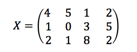
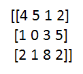

# Case Study II
Trace Smith & Damon Resnick  
December 1, 2016  


<br>

### Question 1

**Create the following X matrix and print it from SAS, R, and Python.**



**SAS Code**

```{}
proc iml;
/*create 3x4 matrix*/
reset print;
x={4 5 1 2,
   1 0 3 5,
   2 1 8 2};
quit;
```

- SAS output for X matrix shown below:


<br>

**R Code**


```r
mymatrix <- matrix(c(4, 1, 2, 5, 0, 1, 1, 3, 8, 2, 5, 2), nrow = 3, ncol = 4)
print(mymatrix)
```

```
##      [,1] [,2] [,3] [,4]
## [1,]    4    5    1    2
## [2,]    1    0    3    5
## [3,]    2    1    8    2
```

 <br>

**Python Code**

```{}
import numpy as np
x = np.matrix([[4,5,1,2],[1,0,3,5],[2,1,8,2]])
print x
```

 - *Python output (Ipython Notebook):*
 


<br>


### Question 2

**The following questions below correspond to Air Products & Chemicals, Inc. stock (symbol = `ADP`):**
  
- **1.) Download the data.**


```r
# SNPdatahist <- get.hist.quote('^gspc',quote='Close')
SNPdata <- get.hist.quote("adp", quote = "Close")
```

```
## time series ends   2016-11-25
```

```r
plot(SNPdata, col = "red", main = "Stock: Air Product & Chemicals, Inc.", xlab = "Index", 
    ylab = "Closing Price")
```


- **2.) Calculate log returns.**


```r
SNPret <- log(lag(SNPdata)) - log(SNPdata)
SNPret <- SNPret[!(is.na(SNPret)), ]
```

- **3.) Calculate volatility measure.**


```r
SNPvol <- sd(SNPret) * sqrt(250) * 100
SNPvol
```

```
## [1] 34.29705
```

- **4.) Calculate volatility over entire length of series for various three different decay factors.**


```r
## volatility
get
```

```
## function (x, pos = -1L, envir = as.environment(pos), mode = "any", 
##     inherits = TRUE) 
## .Internal(get(x, envir, mode, inherits))
## <bytecode: 0x00000000135e7058>
## <environment: namespace:base>
```

```r
Vol <- function(d, logrets) {
    var = 0
    lam = 0
    varlist <- c()
    for (r in logrets) {
        lam = lam * (1 - 1/d) + 1
        var = (1 - 1/lam) * var + (1/lam) * r^2
        varlist <- c(varlist, var)
    }
    sqrt(varlist)
}
```


```r
volest <- Vol(10, SNPret)
volest2 <- Vol(30, SNPret)
volest3 <- Vol(100, SNPret)
```

- **5.) Plot the results, overlaying the volatility curves on the data, just as was done in the S&P example.**


```r
plot(volest, type = "l")
lines(volest2, type = "l", col = "red")
lines(volest3, type = "l", col = "blue")
```


### Question 3

**The built-in data set called Orange in R is about the growth of orange trees. Explore the data:**


```r
# Read in Orange dataset from R into data.frame
df <- data.frame(Orange)
head(df)
```

```
##   Tree  age circumference
## 1    1  118            30
## 2    1  484            58
## 3    1  664            87
## 4    1 1004           115
## 5    1 1231           120
## 6    1 1372           142
```


```r
print("Summary of Orange dataset")
```

```
## [1] "Summary of Orange dataset"
```

```r
summary(df)  #get summary of Orange dataset
```

```
##  Tree       age         circumference  
##  3:7   Min.   : 118.0   Min.   : 30.0  
##  1:7   1st Qu.: 484.0   1st Qu.: 65.5  
##  5:7   Median :1004.0   Median :115.0  
##  2:7   Mean   : 922.1   Mean   :115.9  
##  4:7   3rd Qu.:1372.0   3rd Qu.:161.5  
##        Max.   :1582.0   Max.   :214.0
```


```r
# get structure of each columns
print("Structure of data.frame")
```

```
## [1] "Structure of data.frame"
```

```r
str(df$age)
```

```
##  num [1:35] 118 484 664 1004 1231 ...
```

```r
str(df$circumference)
```

```
##  num [1:35] 30 58 87 115 120 142 145 33 69 111 ...
```


```r
# Convert tree to character
df$Tree <- as.character(df$Tree)
str(df$Tree)
```

```
##  chr [1:35] "1" "1" "1" "1" "1" "1" "1" "2" "2" ...
```


```r
# Take a look at the data
explore.data <- function(data, col.name, n) {
    title <- paste0(n, " vs Tree")
    p <- ggplot(df) + geom_point(aes(y = col.name, x = Tree, colour = Tree, shape = Tree), 
        size = 3) + scale_colour_hue(l = 80, c = 150)
    p + labs(title = title, x = "Tree type", y = n, colour = "Tree") + theme(plot.title = element_text(hjust = 0.5))
}
```


```r
# Call explore.data function to plot age vs tree
x <- df$age
name <- "Age"
explore.data(df, x, name)
```


```r
# Call explore.data function to plot circum vs tree
x <- df$circumference
name <- "Circumference"
explore.data(df, x, name)
```


- **a) Calculate the mean and the median of the trunk circumferences for different size of the trees**


```r
# aggregate data.frame by Tree and compute mean circumference
circum.mean <- aggregate(df$circumference, by = list(df$Tree), FUN = mean)
colnames(circum.mean) <- c("Tree", "Avg_Circumference")
circum.mean
```

```
##   Tree Avg_Circumference
## 1    1          99.57143
## 2    2         135.28571
## 3    3          94.00000
## 4    4         139.28571
## 5    5         111.14286
```


```r
# aggregate data.frame by Tree and compute median circumference
circum.median <- aggregate(df$circumference, by = list(df$Tree), FUN = median)
colnames(circum.median) <- c("Tree", "Med_Circumference")
circum.median
```

```
##   Tree Med_Circumference
## 1    1               115
## 2    2               156
## 3    3               108
## 4    4               167
## 5    5               125
```


- **b) Make a scatter plot of the trunk circumferences against the age of the tree. Use different plotting symbols for different size of trees.**


```r
p <- ggplot(df) + geom_point(aes(y = circumference, x = age, colour = Tree, shape = Tree), 
    size = 3) + scale_colour_hue(l = 80, c = 150)
p + labs(title = "Age vs Circumference by Tree", x = "Age", y = "Circumference", 
    colour = "Tree") + theme(plot.title = element_text(hjust = 0.5))
```


```r
p <- ggplot(df, aes(y = circumference, x = age, colour = Tree)) + geom_point(aes(shape = Tree), 
    size = 3) + geom_line(size = 1, alpha = 0.8) + scale_colour_hue(l = 80, c = 150)
p + labs(title = "Age vs Circumference by Tree", x = "Age", y = "Circumference", 
    colour = "Tree") + theme(plot.title = element_text(hjust = 0.5))
```


- **c) Display the trunk circumferences on a comparative boxplot against tree. Order the boxplots in the increasing order of maximum diameter.**


```r
circum.max <- aggregate(df$circumference, by = list(df$Tree), FUN = max)  #aggregate for max circum
colnames(circum.max) <- c("Tree", "Max Circum.")  #rename columns
circum.max  #knit table
```

```
##   Tree Max Circum.
## 1    1         145
## 2    2         203
## 3    3         140
## 4    4         214
## 5    5         177
```


```r
df$Tree <- factor(df$Tree, c("3", "1", "5", "2", "4"))  #reorder the boxplot for max circum. by tree
p <- ggplot(df, aes(x = Tree, y = circumference)) + geom_boxplot(aes(fill = Tree))  # ggplot: boxplot 
p + labs(title = "Box Plot: Trunk Circumference", y = "Circumference", x = "Tree") + 
    theme(plot.title = element_text(hjust = 0.5))
```


### Question 4

- **i.) First, download “Temp” data set. Find the difference between the maximum and the  minimum monthly average temperatures for each country and report/visualize top 20 countries with the maximum differences for the period since 1900.**


```r
# Create new data.frame to join the two aggregated list'
tempraw <- read.csv("Data/Temp.csv", header = TRUE)
temp <- tempraw
head(temp)
```

```
##         Date Monthly.AverageTemp Monthly.AverageTemp.Uncertainty
## 1 1838-04-01              13.008                           2.586
## 2 1838-05-01                  NA                              NA
## 3 1838-06-01              23.950                           2.510
## 4 1838-07-01              26.877                           2.883
## 5 1838-08-01              24.938                           2.992
## 6 1838-09-01              18.981                           2.538
##       Country
## 1 Afghanistan
## 2 Afghanistan
## 3 Afghanistan
## 4 Afghanistan
## 5 Afghanistan
## 6 Afghanistan
```


**Preprocessing and Exploring the Data:**


```r
# Need to make Date column into a character in order to use grepl to extract out
# other date format
temp$Date <- as.character(temp$Date)

# Deletes all the dates below 1900 because all of those dates are in a different
# format with '-' and not '/'
temp <- temp[!grepl("-", temp$Date), ]

# Remove any columns with 'NA' just to be careful
temp1 <- temp[!(is.na(temp$Date)), ]

# Make Country column a character
temp1$Country <- as.character(temp1$Country)

# return all the rows (i.e. margin=1) with NA
row.with.na <- apply(temp, 1, function(x) {
    any(is.na(x))
})

# Sum all of the rows containing NA
sprintf("Number of Rows Deleted that contained NA's: %s ", sum(row.with.na))
```

```
## [1] "Number of Rows Deleted that contained NA's: 1049 "
```

```r
# Remove the Rows with NA's
temp1 <- temp[!row.with.na, ]
```


```r
# Aggregate for max and min average temps
temp.max <- aggregate(temp1["Monthly.AverageTemp"], by = temp1["Country"], FUN = max)
temp.min <- aggregate(temp1["Monthly.AverageTemp"], by = temp1["Country"], FUN = min, 
    na.rm = TRUE)

# Create new data.frame to join the two aggregated list
data <- data.frame(temp.max, temp.min)

# Drop extra Country column
data$Country.1 <- NULL

# Rename column
colnames(data) <- c("Country", "Max Avg. Temp", "Min Avg. Temp")

# Take difference between max and min avg. temp columns
data$Diff <- data$"Max Avg. Temp" - data$"Min Avg. Temp"

# Sort the dataframe by decreasing Diff
data <- data[order(data$Diff, data$Country, decreasing = TRUE), ]
head(data, 10)
```

```
##          Country Max Avg. Temp Min Avg. Temp   Diff
## 115   Kazakhstan        25.562       -23.601 49.163
## 144     Mongolia        20.716       -27.294 48.010
## 180       Russia        16.893       -29.789 46.682
## 39        Canada        14.796       -28.736 43.532
## 234   Uzbekistan        30.375       -12.323 42.698
## 225 Turkmenistan        32.136        -8.443 40.579
## 22       Belarus        22.811       -16.527 39.338
## 75       Finland        18.967       -20.101 39.068
## 68       Estonia        22.332       -16.483 38.815
## 228      Ukraine        23.936       -14.724 38.660
```


```r
# Subset the data to only take the first 20 columns with highest temp diff.
data.sub <- data[1:20, ]
# plot Country vs Temp Diff
p <- ggplot(data.sub, aes(Country, Diff, fill = Diff)) + geom_bar(stat = "identity") + 
    scale_fill_gradientn(colours = c("dodgerblue1", "darkblue", "firebrick1"), values = scale(c(35, 
        40, 45)))
p + labs(title = "Country vs Change in Temperature", x = "Country", y = "High-Low Avg. Monthly Temp Diff") + 
    theme(plot.title = element_text(hjust = 0.5)) + theme(axis.text.x = element_text(angle = 60, 
    hjust = 1)) + coord_cartesian(ylim = c(30, 50))
```


- **(ii) Select a subset of data called 'UStemp' where US land temperatures from 01/01/1990 in Temp data. Use UStemp dataset to answer the followings.**


```r
# subset to data for only country = 'U.S.'
temp.usa <- subset(temp1, temp1$Country == "United States")
head(temp.usa)
```

```
##          Date Monthly.AverageTemp Monthly.AverageTemp.Uncertainty
## 553218 1/1/00              -2.573                           0.443
## 553219 2/1/00              -2.912                           0.533
## 553220 3/1/00               2.636                           0.358
## 553221 4/1/00               8.091                           0.263
## 553222 5/1/00              14.317                           0.239
## 553223 6/1/00              19.280                           0.379
##              Country
## 553218 United States
## 553219 United States
## 553220 United States
## 553221 United States
## 553222 United States
## 553223 United States
```


```r
# Find the row in which date equals 1/1/90
which(temp.usa$Date == "1/1/90")
```

```
## [1] 1081
```

```r
# delete all of the obs with date before 1990
temp.usa <- temp.usa[-c(1:1080), ]
# change the Date column to date object
temp.usa$Date <- as.Date(temp.usa$Date, format = "%m/%d/%y")
```

- **a) Create a new column to display the monthly average land temperatures in Fahrenheit (°F).**


```r
# Convert Temp from celsius to fahrenheit:
temp.usa$Temp_F <- ((temp.usa$Monthly.AverageTemp * (9/5)) + 32)
head(temp.usa["Temp_F"])
```

```
##         Temp_F
## 554298 29.9786
## 554299 28.8554
## 554300 40.0370
## 554301 48.8840
## 554302 56.7896
## 554303 67.6040
```

- **b) Calculate the average land temperature by year and plot it. The original file has the average land temperature by month.**
 

```r
# Average Land Temperatue by Year:
temp.usa$year <- substr(temp.usa$Date, 1, 4)
df.temp.usa <- do.call(data.frame, aggregate(Temp_F ~ year, data = temp.usa, FUN = mean))
df.temp.usa$year <- as.numeric(as.character(df.temp.usa$year))
# str(df.temp.usa$year)
```


```r
# plot USA yearly avgerage temp
p <- ggplot(df.temp.usa) + geom_line(aes(x = year, y = Temp_F), stat = "identity", 
    lwd = 1, colour = "blue")
p + labs(title = "USA Yearly Avg. Temperature", x = "Year", y = "Temperature (F)") + 
    theme_bw() + theme(panel.grid.major = element_blank(), panel.grid.minor = element_blank()) + 
    theme(axis.text.x = element_text(angle = 60, hjust = 1), legend.position = "none") + 
    theme(plot.title = element_text(hjust = 0.5))
```


- **c) Calculate the one year difference of average land temperature by year and provide the maximum difference (value) with corresponding two years.**


```r
temp.usa.year.diff <- temp.usa$Temp_F[1:23] - temp.usa$Temp_F[2:24]

temp.usa.year.diff.year <- c("1990-1991", "1991-1992", "1992-1993", "1993-1994", 
    "1994-1995", "1995-1996", "1996-1997", "1997-1998", "1998-1999", "1999-2000", 
    "2000-2001", "2001-2002", "2002-2003", "2003-2004", "2004-2005", "2005-2006", 
    "2006-2007", "2007-2008", "2008-2009", "2009-2010", "2010-2011", "2011-2012", 
    "2012-2013")

temp.usa.ydiff <- data.frame(temp.usa.year.diff.year, temp.usa.year.diff)
colnames(temp.usa.ydiff) <- c("Years", "AvgTempDiff")

temp.usa.ydiff$Years2 <- as.integer(temp.usa.ydiff$Years)

p <- ggplot(temp.usa.ydiff) + geom_point(aes(x = Years, y = AvgTempDiff), size = 3, 
    colour = "Red")
p + labs(title = "Yearly Avg. Difference Temperature") + theme_bw() + theme(panel.grid.major = element_blank(), 
    panel.grid.minor = element_blank()) + theme(axis.text.x = element_text(angle = 60, 
    hjust = 1), legend.position = "none") + theme(plot.title = element_text(hjust = 0.5)) + 
    geom_line(aes(x = Years2, y = AvgTempDiff), colour = "Blue", lwd = 1)
```


- **(iii) Download 'CityTemp' data set. Find the difference between the maximum and the minimum temperatures for each major city and report/visualize top 20 cities with maximum differences for the period since 1900. **


```r
citytempraw <- read.csv("./Data/CityTemp.csv", header = TRUE)
citytemp <- citytempraw
head(citytemp)
```

```
##         Date Monthly.AverageTemp Monthly.AverageTemp.Uncertainty
## 1 1850-01-01              15.986                           1.537
## 2 1850-02-01              18.345                           1.527
## 3 1850-03-01              18.632                           2.162
## 4 1850-04-01              18.154                           1.693
## 5 1850-05-01              17.480                           1.237
## 6 1850-06-01              17.183                           1.252
##          City  Country Latitude Longitude
## 1 Addis Abeba Ethiopia    8.84N    38.11E
## 2 Addis Abeba Ethiopia    8.84N    38.11E
## 3 Addis Abeba Ethiopia    8.84N    38.11E
## 4 Addis Abeba Ethiopia    8.84N    38.11E
## 5 Addis Abeba Ethiopia    8.84N    38.11E
## 6 Addis Abeba Ethiopia    8.84N    38.11E
```


```r
# Preprocessing the Data:

# Convert the Date column into a character in order to use grepl to extract out
# other date format
citytemp$Date <- as.character(citytemp$Date)
# Delete all dates below 1900 because all of those dates are in a different
# format with '-' and not '/'
citytemp <- citytemp[!grepl("-", citytemp$Date), ]

row.with.na <- apply(citytemp, 1, function(x) {
    any(is.na(x))
})
sprintf("Number of rows deleted with NA's: %s", sum(row.with.na))
```

```
## [1] "Number of rows deleted with NA's: 92"
```

```r
citytemp1 <- citytemp[!row.with.na, ]
```


```r
# Identify which columns are strings
cols = c(4, 5, 6, 7)
# convert these columns to characters using the apply function
citytemp1[, cols] = apply(citytemp1[, cols], 2, function(x) as.character(x))
# test if worked correctly
str(citytemp1$City)
```

```
##  chr [1:135043] "Addis Abeba" "Addis Abeba" "Addis Abeba" ...
```


```r
# Aggregate for max and min average temps
citytemp.max <- aggregate(citytemp1["Monthly.AverageTemp"], by = citytemp1["City"], 
    FUN = max)
citytemp.min <- aggregate(citytemp1["Monthly.AverageTemp"], by = citytemp1["City"], 
    FUN = min, na.rm = TRUE)

# Create new data.frame to join the two aggregated list
citydata <- data.frame(citytemp.max, citytemp.min)

# Drop extra Country column
citydata$City.1 <- NULL

# Rename column
colnames(citydata) <- c("City", "Max Avg. Temp", "Min Avg. Temp")

# Take difference between max and min avg. temp columns
citydata$Diff <- citydata$"Max Avg. Temp" - citydata$"Min Avg. Temp"

# Sort the dataframe by decreasing Diff
citydata <- citydata[order(citydata$Diff, citydata$City, decreasing = TRUE), ]
head(citydata, 10)
```

```
##                City Max Avg. Temp Min Avg. Temp   Diff
## 34           Harbin        26.509       -26.772 53.281
## 19        Changchun        26.572       -23.272 49.844
## 65           Moscow        24.580       -19.376 43.956
## 85         Shenyang        26.010       -17.035 43.045
## 64         Montreal        23.059       -18.363 41.422
## 48             Kiev        24.593       -16.191 40.784
## 79 Saint Petersburg        21.921       -18.589 40.510
## 96          Toronto        23.181       -15.502 38.683
## 92          Taiyuan        24.718       -13.116 37.834
## 94          Tianjin        28.936        -8.017 36.953
```


```r
# Subset the data to only take the first 20 columns with highest temp diff.
citydata.sub <- citydata[1:20, ]

p <- ggplot(citydata.sub) + geom_point(aes(x = City, y = Diff), size = 3, colour = "Red")
p + labs(title = "Difference per City") + theme(axis.text.x = element_text(angle = 60, 
    hjust = 1), legend.position = "none") + theme(plot.title = element_text(hjust = 0.5))
```


- **(iv) Compare the two graphs in (i) and (iii)**


```r
p4 <- ggplot() + geom_point(data = data.sub, aes(x = data.sub$Country, y = data.sub$Diff), 
    color = "Blue3", size = 3) + geom_point(data = citydata.sub, aes(x = citydata.sub$City, 
    y = citydata.sub$Diff), color = "Red2", size = 3)
p4 + labs(title = "Max Difference for Top 20 Countries/Cities", x = "Countries (Blue) and Cities (Red)", 
    y = "Max Difference") + theme(title = element_text(size = 14), axis.title = element_text(size = 14), 
    axis.text.x = element_text(angle = 60, hjust = 1), legend.position = "none") + 
    theme(plot.title = element_text(hjust = 0.5))
```


**Extra Exploratory Analysis**

```r
hilow <- function(df, x, name) {
    p <- ggplot(data = df, aes(x, Diff, fill = Diff)) + geom_bar(stat = "identity") + 
        coord_cartesian(ylim = c(30, 50)) + scale_fill_gradient(low = "blue", high = "red")
    p + labs(title = "High-Low Average Temp Difference", x = name, y = "Average Temperature Difference") + 
        theme(axis.text.x = element_text(angle = 60, hjust = 1)) + theme(plot.title = element_text(hjust = 0.5))
}
```


```r
# Difference in Average Temp Per Country
country_var <- data.sub$Country
hilow(data.sub, country_var, name = "Country")
```


```r
# Difference in Average Temp Per Country
city_var <- citydata.sub$City
hilow(data.sub, city_var, name = "City")
```


- Looking at the top 20 countries and cities in the world for the temperature swing during a year we see that the City of Harbin has the largest temperature swing, but by and large the countries have a wider temperature swing than the major cities. It is intersting to note that Russia has the 3rd largest temperature swing for a country and has two major cities in the top 20. Canada ranked 4th, also has two top 20 cities while the US is not ranked in the top 20 but has two cities in the top 20.


<br>  


### Question 05  (10 points)   


**Christmas Bonus:**


